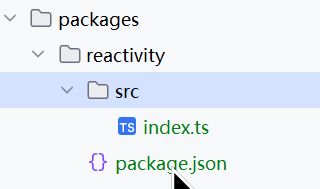
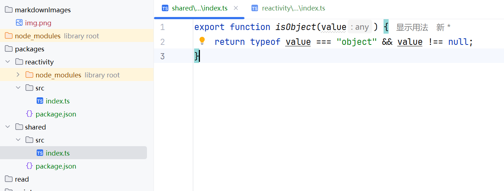
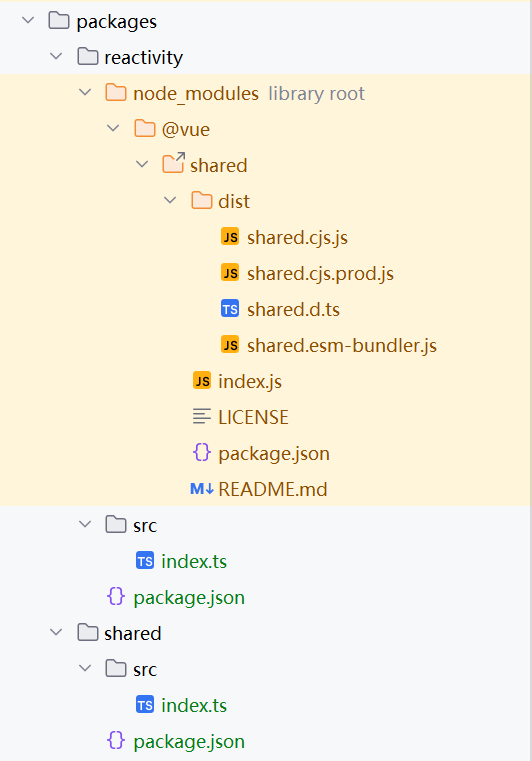

# 拍平
npm会将下载的依赖拍平放入node_modules下, 而pnpm不会

新建一个.npmrc文件, 添加如下配置即可自动拍平
```
shamefully-hoist=true
```

能复用的就拍平, 无法复用的就不拍平

# 安装pnpm
```bash
npm i -g pnpm
```

# 初始化项目

```bash
pnpm init
```

# pnpm-workspace.yaml
根目录新建pnpm-workspace.yaml

告诉pnpm包的目录位置
```
packages:
  - "packages/*"
```

# tsconfig
根目录新建tsconfig.json
```
{
  "compilerOptions": {
    // 输出目录
    "outDir": "dist",

    // 是否采用sourcemap
    "sourceMap": true,

    // 目标语法
    "target": "es2016",

    // 模块格式
    "module": "esnext",

    // 模块解析方式
    "moduleResolution": "node",

    // 严格模式
    "strict": false,

    // 解析json模块
    "resolveJsonModule": true,

    // 允许通过es6语法引入cjs模块
    "esModuleInterop": true,

    // jsx不转义
    "jsx": "preserve",

    // 支持的类库 esnext和dom
    "lib": ["esnext", "dom"],
    
    // 路径别名
    "baseUrl": ".",
    // 路径映射 后续包直接访问直接使用@vue/包名即可
    "paths": {
      "@vue/*": ["packages/*/src"]
    }
  }
}
```

# 包
新建包结构如图所示, shared包也如此新建文件:



其中reactivity中的package.json内容如下
```
{
  "name": "@vue/reactivity",
  "version": "1.0.0",
  "module": "dist/reactivity.esm-bundler.js",
  "main": "dist/reactivity.cjs.js",
  "unpkg": "dist/reactivity.global.js",
  "buildOptions": {
    "name": "VueReactivity",
    "formats": [
      "esm-bundler",
      "esm-browser",
      "cjs",
      "global"
    ]
  },
  "dependencies": {
    "@vue/shared": "^3.5.25"
  }
}
```

shared中的package.json内容如下
```
{
  "name": "@vue/shared",
  "version": "1.0.0",
  "module": "dist/shared.esm-bundler.js",
  "main": "dist/shared.cjs.js",

  "buildOptions": {
    "formats": [
      "esm-bundler",
      "cjs"
    ]
  }
}
```

# 将shared包安装到reactivity中
先新增点代码


在reactivity/src/index.ts中引入试试
```ts
import { isObject } from "@vue/shared";
```
点击链接发现已经可以跳转了,这是tsconfig.ts中配置了别名的作用
```
    // 路径别名
    "baseUrl": ".",
    // 路径映射
    "paths": {
      "@vue/*": ["packages/*/src"]
    }
```

再将shared包安装到reactivity中
```bash
pnpm install @vue/shared -w --filter @vue/reactivity
```
其中-w表示安装工作根目录下的, --filter表示只安装到指定包中

也就是说安装packages下的@vue/shared到packages下的@vue/reactivity中

